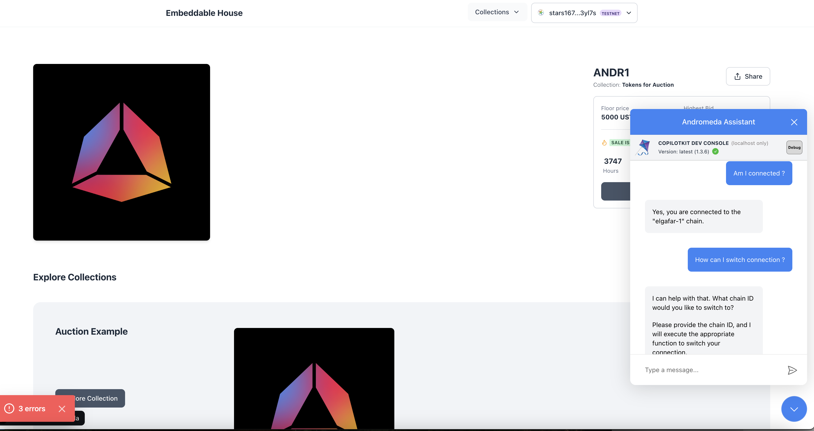

This is a [Andromeda Embeddable Demo](https://github.com/andromedaprotocol/embeddable-marketplace-demo/blob/main/package.json) added with [`copilot kit`](https://docs.copilotkit.ai/).

## Getting Started

First, install dependencies:

```bash
npm i
# or
yarn install
```

Then, change `NEXT_GOOGLE_API_KEY` in `.env` to your Google API key.

You can get one from [Google AI Studio](https://aistudio.google.com/app/apikey).

Then, run the development server:
```bash
npm run dev
# or
yarn dev
```

Open [http://localhost:3000](http://localhost:3000) with your browser to see the result, there'll be a chat popup icon at bottom right corner. You can ask various things including your connection, which chain you are connected to, etc.




Read about the code that adds context to copilot chatbot in [`src/modules/default/components/DefaultApp.tsx`]()

## Next Step
1. Connect the copilot to action and see if it will work especially for switching between chains and sign transactions.

## Learn More

To learn more about Copilot kit, take a look at the following resources:

- [Copilotkit Documentation](https://docs.copilotkit.ai/) 

To learn more about Andromeda, take a look at the following resources:
- [Andromeda Documentation](https://docs.andromedaprotocol.io/andromeda) 

You can check out [Andromeda GitHub repository](https://github.com/andromedaprotocol).


## Licensing

[Terms and Conditions](https://github.com/andromedaprotocol/andromeda-core/blob/development/LICENSE/LICENSE.md)
